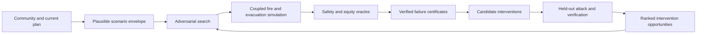

# Firescape

**An open-source adversarial laboratory for falsifying wildfire evacuation plans and ranking interventions.**

> **Status:** Conditional GO for a bounded implementation and algorithmic research program. Firescape does not provide live evacuation guidance, certify community safety, or replace emergency-management authority. See the [first end-to-end research decision](research/first-loop/GATE_REPORT.md).

Wildfire evacuation plans are normally tested against a small collection of expected or manually selected scenarios. Real disasters can combine unusual fire approaches, warning delays, uneven message delivery, late departures, route noncompliance, institutional demand, crashes, road loss, smoke, and regional congestion.

Firescape searches deliberately for those dangerous combinations.

It attacks an evacuation plan, verifies and minimizes the failures it discovers, tests possible repairs, attacks the repaired system again, and ranks the interventions that appear most capable of reducing harm.

## The core idea

Firescape is not primarily another fire simulator, traffic simulator, evacuation map, or route planner. It is an adversarial orchestration and evidence layer around replaceable fire, traffic, behavior, and communication models.

The loop is:

1. Construct a community evacuation system and encode its current or candidate plan.
2. Declare the fire, warning, behavior, transportation, and institutional conditions that the experiment may vary.
3. Search for severe but plausible scenarios that break the plan.
4. Reproduce suspected failures in the strongest available simulation path.
5. Remove unnecessary conditions to identify the smallest sufficient cause.
6. Cluster failures into recurring causal families.
7. Test operational, communication, mobility, vegetation, refuge, and infrastructure interventions.
8. Attack each intervention with unseen scenarios and alternative assumptions.
9. Rank interventions by robust harm reduction, equity, feasibility, cost, actor fit, and evidence confidence.
10. Convert every verified failure into a permanent regression test.

Firescape never declares a plan safe. It reports what was attacked, what failed, what survived, and what remains unknown.

## What Firescape ranks

Firescape does **not** publish a simplistic ranking of the “worst towns.” Its atomic unit is:

> **community evacuation system × verified failure family × candidate intervention package**

An example result might be:

> Simultaneous release of Zones A–C repeatedly creates an exposed queue at Junction J under a late-warning, north-approach fire family. Releasing Zone C eight minutes earlier and staffing two traffic-control posts eliminates that failure in 78% of held-out severe scenarios, improves the worst-served zone, and remains sensitive to uncertainty in Corridor K's capacity.

The public outputs are:

- **Failure certificates:** reproducible, minimized explanations of how a plan fails.
- **Intervention cards:** exact repairs, responsible actors, required resources, modeled benefits, residual failures, and evidence limitations.
- **Intervention rankings:** the highest-confidence and highest-potential opportunities for reducing evacuation harm.
- **Failure-mechanism registry:** recurring causal patterns that transfer across communities.
- **Evidence priorities:** measurements, drills, surveys, or local facts most likely to change a decision.
- **Coverage reports:** what the adversary searched, what it excluded, and where evidence remains weak.

Sometimes the most useful output will be an intervention. Sometimes it will be:

> A two-day traffic-count study at this junction has greater expected decision value than choosing between the proposed road projects with current evidence.

## What “worst case” means

The possible combination of fires, human behavior, infrastructure failures, and official decisions is effectively infinite. Firescape cannot test every possible disaster.

Instead, each experiment declares a **plausibility envelope** containing:

- the scenario variables being searched;
- valid ranges and units;
- dependencies and incompatible combinations;
- the evidence behind each assumption;
- excluded mechanisms;
- the simulation budget;
- coverage and convergence evidence.

Within that envelope, Firescape searches for the most severe reproducible cases it can find. It is not allowed to manufacture catastrophe by making every road fail or selecting physically incompatible conditions.

“Worst case” means:

> The most severe reproducible case found inside a stated plausibility envelope and computation budget.

It does not mean the worst event reality could produce.

## Initial scope

### California first

California is the initial geography because it combines substantial wildfire exposure, varied community and road topologies, extensive public spatial data, active evacuation planning, and identifiable state and local decision makers.

### Statewide-addressable, full-pipeline-on-demand

The intended mature system can accept any California point, evacuation zone, community, or planning area and construct a complete Firescape experiment.

This does not imply that every location has already been simulated or locally calibrated. Coverage states will distinguish:

- not yet tested;
- constructed but awaiting review;
- exploratory;
- verified for a stated scenario envelope;
- insufficient evidence;
- restricted because the findings are sensitive;
- superseded by newer plans, data, or models.

The project should behave like an open scientific observatory whose verified statewide coverage grows over time.

### First validation case

The recommended initial end-to-end case is Paradise–Magalia, California, because the 2018 Camp Fire provides unusually rich evidence about notification, evacuation, congestion, temporary refuge, and fire interaction.

The first case is a scientific test of the method—not a claim that Firescape has reconstructed every historical event detail.

## Scenario domains

The adversary may search combinations across:

### Fire and weather

- ignition location and time;
- wind speed, direction, and shifts;
- temperature, humidity, and fuel moisture;
- spotting and secondary ignition;
- fire-arrival uncertainty;
- smoke and visibility effects.

### Warning and communication

- authority decision delay;
- delayed or geographically uneven delivery;
- channel, power, or cellular failure;
- conflicting instructions;
- language and accessibility barriers;
- navigation-service availability.

### Households and travelers

- awareness and preparation delay;
- early self-evacuation;
- timing and route compliance;
- familiar-route preference;
- household reunification;
- vehicle availability and occupancy;
- mobility assistance;
- tourist behavior;
- vehicle abandonment.

### Transportation

- background traffic;
- uncertain road and intersection capacity;
- crashes, stalls, and blocked lanes;
- smoke-reduced speeds;
- contraflow delays;
- inbound emergency vehicles;
- downstream and neighboring-community congestion.

### Institutions and supported evacuation

- school dismissal and pickup;
- hospital and care-facility movement;
- paratransit and bus capacity;
- staff and loading delays;
- refuge and shelter availability.

## Intervention families

Firescape can test:

- warning and order timing;
- staged versus simultaneous release;
- route and destination allocation;
- intersection control and contraflow;
- emergency-only capacity;
- redundant and targeted communications;
- school and care-facility procedures;
- buses, paratransit, and assisted evacuation;
- temporary refuge and shelter contingencies;
- roadside vegetation treatment and corridor hardening;
- shoulder use, signal backup, widening, intersection redesign, and connector roads;
- evidence collection when uncertainty is the binding constraint.

Every intervention must name an actor capable of using it: a county, city, emergency-management office, transportation agency, fire or law-enforcement organization, school district, care facility, communications provider, or research group.

## Ranking principles

Each opportunity is scored independently on:

1. modeled harm reduction;
2. number and diversity of failure families eliminated;
3. population protected;
4. improvement for the worst-served group;
5. robustness under held-out attacks and model changes;
6. operational, legal, and engineering feasibility;
7. cost-effectiveness;
8. implementation speed;
9. existence of an implementing actor and decision venue;
10. evidence confidence;
11. transferability.

The headline opportunity score is multiplicative. One excellent dimension cannot compensate for a fatal weakness.

Strong penalties or publication vetoes apply when:

- controlling road, demand, or behavioral assumptions are unsupported;
- the intervention requires unavailable authority, staff, property, or equipment;
- success appears only in a learned surrogate or simplified model;
- reasonable model changes reverse the result;
- the intervention worsens the worst-served population;
- the scenario is not jointly plausible;
- no identifiable decision can use the output.

Firescape reports score intervals, evidence tiers, sensitivities, and ties rather than false ordinal precision.

## Scientific hypothesis

The central falsifiable claim is:

> Given an equal budget of expensive simulations, Firescape discovers more severe, plausible, reproducible, and causally diverse evacuation-plan failures than random, stratified, historical, or expert-authored scenario selection. Interventions chosen through the attack–repair–retest loop then reduce held-out safety tail risk without worsening the worst-served population.

The project should stop or substantially change direction if:

- adversarial search does not beat strong scenario-selection baselines;
- discovered failures are mainly implausible or simulator-specific;
- minimized failures do not produce actionable causal explanations;
- intervention rankings reverse under reasonable model shifts;
- outputs cannot influence a plan, exercise, engineering study, evidence collection, or funding decision.

The first evidence loop found a credible residual contribution only in the open adversarial verification, minimization, and held-out retest workflow—not in generic coupled simulation. See the [research decision](research/first-loop/GATE_REPORT.md) and [implementation and algorithmic research backlog](RESEARCH_BACKLOG.md).

## Existing systems and Firescape's intended contribution

Coupled wildfire evacuation systems and commercial planning products already exist. Relevant examples include:

- [WUI-NITY](https://publications-cnrc.canada.ca/eng/view/object/?id=2a4d9ef8-0f7d-4d60-9586-aae5385a47dd), which couples wildfire, pedestrian, behavior, and traffic models;
- [Ladris Evac](https://www.ladris.com/products/evac) and [Ladris Fire](https://www.ladris.com/product/fire-1), which provide commercial evacuation and fire modeling;
- [Genasys Protect EVAC](https://investors.genasys.com/genasys-protect-evac/), which supports zone-based evacuation management;
- academic work on coupled fire–traffic simulation, staged evacuation, dynamic rerouting, and hazard-aware optimization.

Firescape does not claim novelty from combining fire and traffic. Its intended contribution is the complete open loop:

> adversarial search → verification → counterexample minimization → causal clustering → intervention testing → held-out attack → evidence-gated ranking.

## Public-data starting points

The core research hypothesis should be testable without private phone-location data or named household records.

Potential public inputs include:

- [LANDFIRE](https://landfire.gov/data) terrain, fuel, and canopy products;
- [USGS 3DEP](https://www.usgs.gov/3dep-product-news) elevation;
- [NOAA HRRR](https://registry.opendata.aws/noaa-hrrr-pds/) weather archives;
- [CAL FIRE historical fire perimeters](https://www.fire.ca.gov/what-we-do/fire-resource-assessment-program/fire-perimeters);
- OpenStreetMap and Census TIGER/Line roads;
- Census, American Community Survey, and LODES population data;
- [Caltrans PeMS](https://dot.ca.gov/programs/traffic-operations/mpr/pems-source) traffic data;
- published evacuation surveys, drills, and incident case studies.

Public data are sufficient for a geographically grounded research benchmark. Operational recommendations require local review and better evidence.

## Intended technical structure

Firescape will own:

- versioned experiment schemas;
- California data ingestion and provenance;
- simulator adapters;
- scenario baselines and adversarial search;
- safety, clearance, equity, operability, and plausibility oracles;
- failure reproduction, minimization, and clustering;
- intervention evaluation;
- evidence-gated ranking;
- reproducible experiment manifests and public result cards.

It should reuse established fire and traffic engines rather than recreating them. Learned surrogates may guide expensive simulation toward informative scenarios, but a surrogate may never certify a failure or intervention.

## Initial proof target

Within the first focused research cycle, Firescape should:

1. construct one reproducible California community experiment;
2. run a coupled fire-arrival and evacuation simulation;
3. implement random and stratified scenario baselines;
4. implement one adversarial search method;
5. discover and minimize at least three distinct failure families;
6. test at least three operational interventions;
7. evaluate interventions on unseen attacks;
8. publish the complete experiment package, including negative results.

The decisive question is not whether the simulation looks realistic. It is whether the adversarial method discovers important failures more efficiently than strong baselines and helps identify a repair that remains useful when attacked again.

## Non-goals

Firescape is not initially intended to:

- forecast the exact path of an active wildfire;
- issue evacuation orders;
- provide consumer turn-by-turn navigation;
- replace incident command;
- guarantee safety;
- estimate exact fatalities;
- test literally every possible scenario;
- rank towns using incomparable evidence;
- build a new fire-physics or traffic engine unnecessarily;
- model named residents;
- use opaque AI agents as behavioral ground truth;
- accept surrogate predictions as verified results;
- become a general all-hazard platform before the wildfire hypothesis is validated.

## Safety and disclosure

Firescape outputs are planning and research evidence, not live operational instructions.

The project will use synthetic populations and aggregate demographics. Detailed choke points, communication vulnerabilities, or infrastructure dependencies may require coordinated disclosure. Open benchmarks can use synthetic or appropriately coarsened systems when full local detail would create risk.

Every published result must preserve the chain from source data through scenario, simulation, failure, intervention, and score.

## Contributing

The project is ready for narrowly scoped research-kernel implementation contributions. The current priorities are:

- versioned schemas, manifests, and deterministic experiment execution;
- exhaustively enumerable golden failure worlds and safety oracles;
- public data provenance and the Paradise–Magalia evidence ledger;
- SUMO and ELMFIRE adapters with contract tests;
- strong scenario-selection baselines, especially Sobol and cross-entropy search;
- replay, counterexample minimization, and held-out intervention evaluation.

Statewide ingestion, operational routing, product UI, and deep-learning work remain gated. Please open a discussion or issue before starting a substantial implementation and identify the exact backlog item it advances.

## License

Firescape is intended to be open source. A software license has not yet been added; until one is present, the repository's contents remain under default copyright and should not be assumed reusable. Selecting and adding the license is an explicit backlog item before code release or outside contributions.

## Research backlog

The prioritized hypotheses, experiments, baselines, success criteria, and kill conditions are maintained in [RESEARCH_BACKLOG.md](RESEARCH_BACKLOG.md).

---

Firescape should not be judged by how frightening its simulations look or how many scenarios it runs. It should be judged by whether it discovers an important failure ordinary testing missed, explains that failure well enough to act on it, identifies a feasible repair, and produces evidence that the repair remains useful when attacked again.
