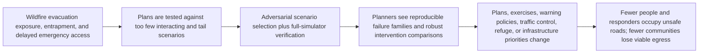
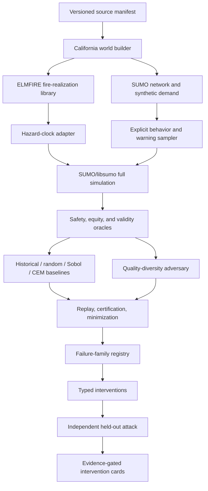

# Firescape first end-to-end research loop

**Decision:** Conditional GO

**Decision date:** 2026-08-08

**Authorized scope:** Build and test an open research instrument. Do not yet build an operational evacuation product or publish community safety claims.

## Executive decision

Firescape remains worth pursuing, but only after narrowing its claim.

The broad idea—coupling wildfire, traffic, warning, and human-behavior simulation—is active, increasingly well supplied, and partly commercialized. WUI-NITY already couples fire, pedestrian, behavior, and traffic models; Ladris sells fire and evacuation analysis; Genasys supports zone-based evacuation operations; and recent academic systems add multimodal agents, fire-driven closures, phased evacuation, reinforcement learning, and learned traffic surrogates.

The credible residual opportunity is more specific:

> Build an open, reproducible adversarial-testing layer that searches a declared plausibility envelope for rare evacuation-plan failures, verifies those failures in full simulators, minimizes them into causal certificates, and evaluates proposed repairs against independent held-out attacks.

No accessible system found in this research loop demonstrated that complete workflow on a geographically grounded wildfire evacuation case. That is comparative evidence of a residual opportunity, not proof that nobody has attempted any component.

The first loop therefore authorizes work through an algorithmic gate. It does not authorize statewide scaling, operational recommendations, live routing, or a claim that Firescape predicts casualties.

## Research artifacts

- [Evidence appendix](report.md): generated from all three independently researched and schema-validated records, with uncertain claims omitted
- [Architecture review](ARCHITECTURE_REVIEW.md): v0 boundaries, tradeoffs, risks, and revisit triggers
- [Research outline](outline.yaml) and [field schema](fields.yaml)
- `results/`: structured evidence records for landscape/adoption, public data/simulators, and the algorithm/go gate
- [Implementation and algorithmic research backlog](../../RESEARCH_BACKLOG.md)

## The pathway being tested

The weakest links are behavioral ground truth, local-road capacity calibration, coupled-model validity, and institutional adoption. They are gates, not hidden assumptions.

## Attention and neglectedness finding

### What is crowded

These are not defensible neglectedness or novelty claims:

- generic wildfire spread prediction;
- generic traffic simulation;
- generic evacuation route optimization;
- coupling a fire model to a traffic model;
- applying reinforcement learning to routing;
- building another visual scenario dashboard;
- using an LLM to imitate evacuee decisions.

There are active research clusters in fire modeling, agent-based evacuation, transportation engineering, human factors, emergency communications, and operations research, plus commercial planning and zone-management products. The broad field has grown since 2020.

### What appears differentially neglected

The narrower bottleneck receives much less visible effort:

1. define a joint, evidence-bearing plausibility envelope;
2. search it adaptively for severe and causally different failures;
3. replay discoveries in the full simulation path across stochastic seeds;
4. minimize each failure into a stable causal certificate;
5. cluster failures by mechanism rather than parameter distance;
6. test repairs against fresh attacks from another search method;
7. publish simulator-call accounting, invalid-scenario rates, model disagreement, and negative results.

The closest systems generally optimize evacuation, explore authored scenarios, estimate clearance, visualize plans, or support live zone management. None found in this dated search exposed the complete falsification-and-repair loop as an open reproducible benchmark.

### Why it may have been neglected

This is partly opportunity and partly warning:

- fire, transport, behavior, and warning evidence live in separate communities and formats;
- serious calibration is local, expensive, and often proprietary;
- academic incentives favor a new simulator or optimizer over validation infrastructure;
- failure search can optimize simulator artifacts;
- public agencies need legible, procurement-compatible evidence, not a better abstract score;
- a benchmark can succeed technically while changing no real decision.

Open engines, structured incident evidence, public spatial data, cheap containerized compute, and transferable stress-testing algorithms now make a bounded solo test plausible. The validation and adoption warnings remain.

## Closest systems and residual claim

| System | Existing capability | Consequence for Firescape |
|---|---|---|
| [WUI-NITY 4](https://content.nfpa.org/-/media/Project/Storefront/Catalog/Files/Research/Research-Foundation/Reports/WUI/RFWUI-NITY4.pdf) | Coupled wildfire, pedestrian decision/movement, traffic, FARSITE/SUMO paths, stochastic warning triggers | Strongest conceptual comparator; Firescape cannot claim novelty from coupling. The report repeatedly identifies behavioral-data gaps. |
| [Ladris Evac and Fire](https://www.ladris.com/) | Commercial fire and evacuation analysis used by local governments | Demonstrates real demand. Public materials do not expose the open equal-budget certificate/minimization/retest protocol. |
| [Genasys Protect EVAC](https://investors.genasys.com/genasys-protect-evac/) | Zone planning, communications, and operational evacuation management | Likely complement or consumer, not the scientific baseline. |
| [PyroRL](https://joss.theoj.org/papers/10.21105/joss.06739) | Open RL environment for simplified wildfire evacuation | Useful algorithm-interface reference and possible golden world, but not geography-grounded evidence. |
| [AgentEvac](https://github.com/denoslab/AgentEvac) | New open SUMO simulator with configurable LLM-driven behavior | Close implementation reference; LLM behavior is not incident ground truth and the full certificate/retest workflow was not identified. |
| Recent academic and California traffic studies | Fire-driven closures, staged release, contraflow, multimodal agents, dynamic routing | Establish strong baselines. Usually case-specific or optimizer-focused rather than shared adversarial failure-family coverage. |

The residual claim is therefore the open audit protocol, not a new fire model, traffic model, dashboard, or coupled simulator.

## Why now

1. **Executable engines.** [SUMO](https://eclipse.dev/sumo/docs/) is a mature, open, scriptable microscopic traffic engine. [ELMFIRE](https://github.com/lautenberger/elmfire) is an open fire-spread engine with Monte Carlo and reconstruction workflows.
2. **Unusually rich incident evidence.** NIST's [Camp Fire life-safety study](https://www.nist.gov/programs-projects/wildland-urban-interface-wui-fire-data-collection-parcel-vulnerabilities/nist/life) contains more than 2,600 spatiotemporal observations across fire progression, notifications, traffic, closures, abandoned vehicles, and temporary refuge.
3. **Public data stack.** LANDFIRE, NOAA HRRR, USGS elevation, Census/ACS/LODES, OpenStreetMap, Caltrans counts/PeMS, and published incident studies support a public benchmark without private device traces.
4. **Algorithm transfer.** Adaptive stress testing, cross-entropy rare-event search, importance sampling, MAP-Elites, and quality diversity are established elsewhere but are not a standard open wildfire-evacuation plan-testing stack.
5. **Decision hook.** [California AB 747](https://leginfo.legislature.ca.gov/faces/billNavClient.xhtml?bill_id=201920200AB747) requires evacuation-route and capacity/safety/viability analysis across scenarios. Municipal purchases of evacuation simulation show that real planning budgets exist.
6. **Solo-scale decomposition.** Precompute fire realizations, then replay many traffic, warning, and behavior scenarios instead of tightly co-simulating every search step.

## Public evidence and chosen stack

| Domain | Initial source | Critical limitation |
|---|---|---|
| Roads | OpenStreetMap, Census TIGER/Line | Lane, turn, control, and local capacity attributes require validation |
| Population | Census blocks, ACS, 2022 LODES | Synthetic aggregates cannot reveal incident-specific people or destinations |
| Traffic | [Caltrans PeMS](https://dot.ca.gov/programs/traffic-operations/mpr/pems-source), highway/local public counts | PeMS is highway-heavy; local streets remain thinly observed |
| Terrain/fuel | [LANDFIRE](https://landfire.gov/data), USGS 3DEP | Fuel and resolution uncertainty propagate into arrival time |
| Weather | NOAA HRRR and incident observations | Local wind and reanalysis error remain material |
| Fire history | CAL FIRE perimeters, NIST Camp Fire reconstruction | Perimeters are not exact road-level arrival truth |
| Warning/evacuation | NIST reports, orders, timelines, surveys | Individual decisions and trajectories remain incomplete |
| Behavior | Published surveys and WUI-NITY literature | Reviews repeatedly identify departure, route, destination, and vulnerable-population gaps |

### Architecture

- Python 3.11 orchestration with Pydantic schemas.
- GeoPandas/Rasterio for geography and DuckDB/Parquet/JSONL for artifacts.
- Containerized SUMO/libsumo for full traffic verification.
- Containerized ELMFIRE for time-indexed fire-arrival/exposure libraries.
- A hazard-clock adapter converts fields into edge speed, capacity, closure, reopening, and exposure events.
- A deterministic small network engine supplies exhaustive golden tests.
- Behavior uses transparent stochastic archetypes and correlations, not LLMs.
- Learned surrogates may select simulations only after a sufficiently large versioned run corpus exists; they never certify results.

One-way hazard replay is accepted only for v0 interventions that do not materially affect fire behavior. If mapping or feedback assumptions reverse a result, the intervention is blocked pending stronger coupling.

## Scenario and oracle contract

Every scenario distinguishes:

1. epistemic uncertainty in world properties;
2. aleatory event draws and seeds;
3. controllable plan/intervention variables;
4. evidence, units, transformations, dependencies, and plausibility constraints.

The v0 safety oracle is lexicographic:

1. unsafe person-minutes;
2. people with no viable safe/refuge path;
3. vehicles or queues overtaken;
4. emergency-access obstruction minutes;
5. zone clearance lateness;
6. worst-zone and worst-served-group outcomes;
7. total clearance and delay as secondary outcomes.

Weighted scores may guide search, but reporting remains disaggregated. Conservation, temporal consistency, finite-value, provenance, and joint-plausibility oracles reject invalid runs.

## Algorithmic experiment

### Baselines

All methods receive identical full-simulator-call and accounting budgets:

- exhaustive enumeration on golden worlds;
- reconstructed historical and analyst-authored scenarios;
- uniform random and stratified extremes;
- Latin hypercube or Sobol sampling;
- standalone cross-entropy method (CEM), the strongest initial adaptive baseline.

### Candidate

Use MAP-Elites or CMA-ME with uncertainty-aware elite promotion and CEM/local/random emitters. The archive descriptors must correspond to causal failure mechanisms such as first failed zone, dominant choke/cut set, warning-capacity interaction, affected group, refuge dependence, or emergency-access conflict.

Deep reinforcement learning is deferred because the first problem is initial scenario selection, not yet a demonstrated sequential adversary. Graph or differentiable surrogates are deferred until learning curves over a real run corpus show that they improve full-simulator sample efficiency.

### Certification

A proposed failure becomes a certificate only after full-simulator replay across held-out seeds, validity/plausibility checks, hierarchical delta minimization, a causal signature, and model-sensitivity reporting.

### Search gate

After profiling freezes the exact call budget, run 10 preregistered seeds. The candidate passes if it achieves either:

- at least 25% more area under the verified severe-failure-family coverage curve than the strongest non-QD baseline; or
- at least two additional verified causal families at the same budget;

on at least 8 of 10 seeds with no more than 5% invalid proposals.

### Intervention gate

At least one implementable intervention must reduce held-out CVaR of unsafe person-minutes by at least 30%, worsen the worst-served group by no more than 5%, and retain the direction of benefit across at least two reasonable behavior/fire variants. The held-out attacker must differ from the method that selected the repair.

The thresholds may be revised only before the preregistration is signed and before comparative results are inspected.

## First 30–60 days

### Days 1–10

- create pinned environments, schemas, provenance, canonical run IDs, and a deterministic runner;
- build six exhaustively enumerable queue-overtake, merge-gridlock, road-isolation, warning-compression, emergency-access, and equity-regression worlds;
- implement conservation, validity, and safety oracles.

### Days 11–25

- implement replay and minimization;
- build the NIST Camp Fire evidence ledger;
- construct and validate the Paradise–Magalia SUMO road network;
- create synthetic population/demand and acceptable traffic/behavior ensembles.

### Days 26–38

- generate or ingest a small traceable ELMFIRE fire-arrival library;
- implement hazard-clock and SUMO adapters;
- reproduce selected qualitative historical mechanisms rather than claim an exact reconstruction.

### Days 39–50

- implement historical, random, stratified, Sobol, CEM, and QD methods through one evaluator port;
- freeze budget, descriptors, seeds, endpoints, invalidity rules, and analysis code;
- run golden and Paradise comparisons.

### Days 51–60

- certify and minimize failure families;
- compile at least three interventions such as staged release, intersection control, and temporary refuge;
- run independent held-out attacks;
- publish the go/pivot/stop result, including negative evidence.

If full fire reconstruction becomes the critical path, the first method gate may use a traceable published arrival-time field while ELMFIRE integration continues. Full SUMO verification and a provenance-bearing hazard field remain mandatory.

## Twelve-month proof target

- an open benchmark with exhaustive synthetic worlds and two California geographies;
- a versioned Paradise–Magalia evidence package;
- reproducible ELMFIRE/SUMO execution with alternate-model checks;
- one adversarial method that passes the equal-budget gate;
- independently replayable and minimized failure certificates;
- one intervention that passes held-out tail-risk and equity gates;
- a second geography held out until method choices are frozen;
- critique by a wildfire-evacuation researcher and a practitioner;
- one identifiable decision the evidence could inform;
- a complete negative result if the central hypothesis fails.

Statewide rankings and live operational use are outside this target.

## Decision scorecard

| Dimension | Score / 10 | Reason |
|---|---:|---|
| Importance | 9.0 | Evacuation failure can produce mass exposure, entrapment, deaths, and responder risk |
| Causal leverage | 7.0 | Testing can change warnings, staging, control, refuge, exercises, and capital priorities, but cannot eliminate fire risk |
| Differential neglectedness | 7.0 | Coupled simulation is active; the open adversarial certificate/retest stack is much less developed |
| New tractability | 8.0 | Open engines, NIST evidence, public spatial data, containers, and transferred search methods permit a solo test |
| Experimental accessibility | 8.0 | Golden worlds and public simulation can falsify the method without private data |
| Marginal contribution | 8.0 | A reusable benchmark, certificate format, and honest negative result would add information |
| Translation probability | 6.5 | Planning duties and municipal purchases create a route, but no adopter is committed |
| Evidence confidence | 6.5 | System/data evidence is strong; behavior and competitor-absence claims are less certain |

Unpenalized geometric mean: **7.45/10**.

Penalties: behavioral/local-road ground truth (−0.35), sim-to-reality and cross-model risk (−0.20), no committed practitioner (−0.15), and one-case overfit risk (−0.10).

**Opportunity-adjusted score: 6.65/10.**

**GO/NO-GO rating: 7/10 conditional GO.**

## Red-team result

The strongest rejection argument is that uncertain behavior, local traffic, and fire-arrival assumptions dominate outcomes, so adversarial search merely adds computational theater to failures a competent planner already anticipates. If reasonable acceptable worlds reorder the failure families or interventions, Firescape should stop ranking repairs and pivot to ranking measurements, drills, surveys, or engineering studies by value of information.

Success is useful beyond Paradise only if the reusable contribution is the simulator-agnostic schema, search protocol, validity accounting, certificate/minimization format, held-out attack, and coverage report. If the advantage depends on Paradise-specific descriptors or one SUMO/ELMFIRE artifact, the transfer claim fails.

Because relevant work spans fire safety, transport, human factors, emergency management, and commercial systems, novelty must be phrased as “no accessible equivalent found in this dated search.” Author, vendor, and practitioner outreach remains required before a publication claim.

## Frozen stop and scale rules

Stop the adversarial-algorithm thesis if:

- CEM, Sobol, or stratified extremes saturate failure-family discovery;
- QD gains disappear after calls, invalid proposals, tuning, and wall time are counted;
- failures are unstable, impossible to minimize, or primarily simulator artifacts;
- reasonable behavior, traffic, hazard mappings, or alternate models reverse results;
- the oracle cannot be connected to a decision-relevant harm proxy.

Scale beyond the first case only if:

- the search-superiority and intervention gates pass;
- the method transfers to a second hidden geography or model;
- an identifiable practitioner confirms a legitimate planning, exercise, study, data, or funding decision use.

## Conclusion

Firescape is a GO as a falsifiable algorithm-and-evidence research project. It is not yet a GO as a statewide product.

The next scarce resources should go into the smallest complete loop:

> golden failures → public Paradise world → strong baselines → quality-diversity attack → full-simulator verification → minimized certificate → intervention → independent retest

The project earns expansion only if that loop beats CEM and quasi-random search and produces a repair that survives model and equity checks.

## Principal sources

- [NIST Camp Fire life-safety, evacuation, and temporary-refuge program](https://www.nist.gov/programs-projects/wildland-urban-interface-wui-fire-data-collection-parcel-vulnerabilities/nist/life)
- [NIST NETTRA technical report](https://tsapps.nist.gov/publication/get_pdf.cfm?pub_id=936322)
- [WUI-NITY 4 final report](https://content.nfpa.org/-/media/Project/Storefront/Catalog/Files/Research/Research-Foundation/Reports/WUI/RFWUI-NITY4.pdf)
- [Caltrans wildfire evacuation research gaps](https://dot.ca.gov/-/media/dot-media/programs/research-innovation-system-information/documents/preliminary-investigations/pi-0334-final-a11y.pdf)
- [SUMO documentation](https://eclipse.dev/sumo/docs/)
- [ELMFIRE repository](https://github.com/lautenberger/elmfire)
- [California AB 747](https://leginfo.legislature.ca.gov/faces/billNavClient.xhtml?bill_id=201920200AB747)
- [Adaptive Stress Testing formulation](https://arxiv.org/abs/2004.04293)
- [Quality-diversity failure-scenario generation](https://arxiv.org/abs/2012.04283)
- [Rare-event simulation review](https://arxiv.org/abs/1508.05047)
- [PyroRL](https://joss.theoj.org/papers/10.21105/joss.06739)
- [AgentEvac](https://github.com/denoslab/AgentEvac)

## Evidence limitations

- A robust bibliometric count could not be obtained from the available APIs. Attention claims use a dated system/literature landscape, active groups, products, recent papers, and review findings rather than false-precision paper counts.
- Absence of a discovered open equivalent is not proof of absence.
- NIST's Camp Fire evidence is rich but not a complete individual trajectory dataset.
- Public data can support a research benchmark; by itself it cannot support live instructions or certify local safety.
